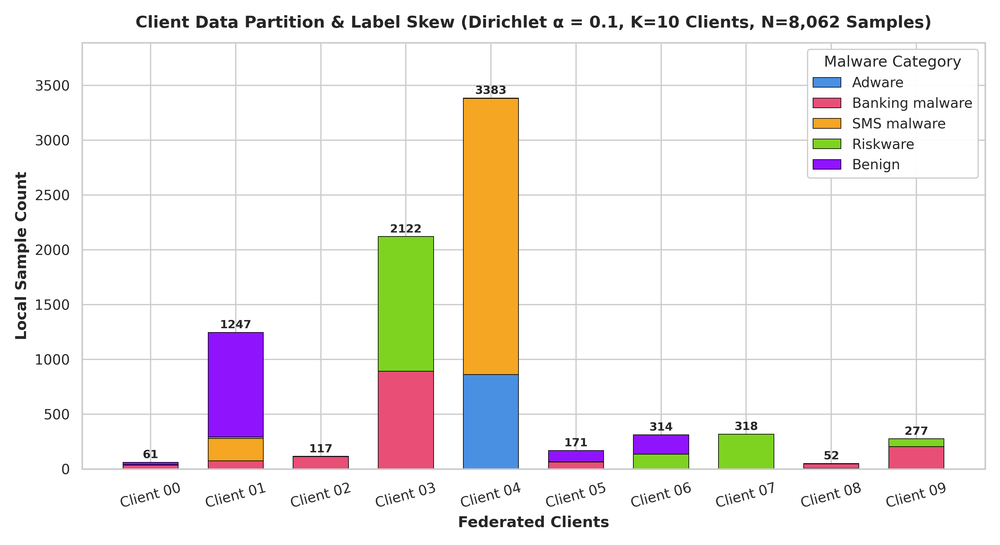
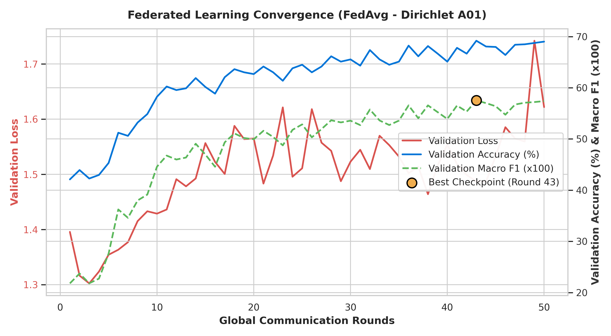
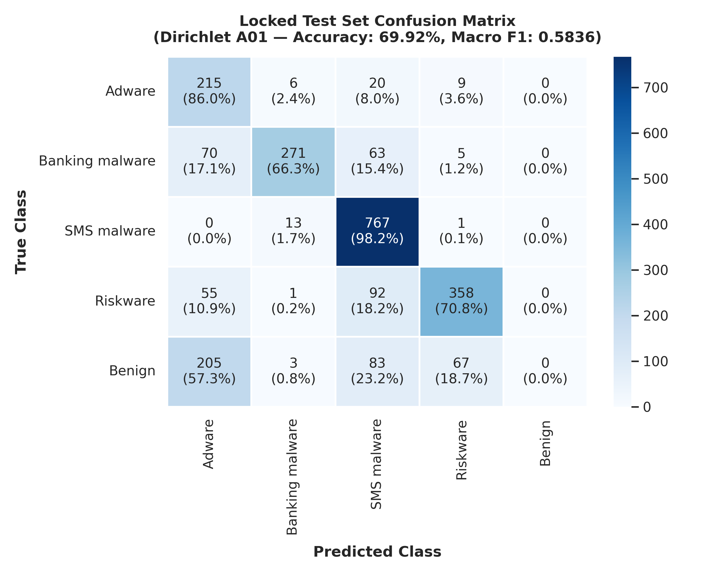

# Experiment 4 — FedAvg Extreme Non-IID Dirichlet (α = 0.1)

**Generated:** 2026-08-25 15:28:40  
**Project:** Privacy-Preserving Malware Detection Using Federated Learning  
**Algorithm:** Federated Averaging (FedAvg, McMahan et al., 2017) with Sample-Weighted Aggregation  
**Partition Strategy:** Extreme Non-IID Dirichlet Distribution (alpha = 0.1) across 10 Clients  
**Model Architecture:** PyTorch MLP (`MalwareMLP`, 156,037 parameters)  

---

## 1. Executive Summary & Multi-Experiment Comparison

In Experiment 4 (Phase 5D), we evaluated Federated Averaging under **extreme non-IID label skew (Dirichlet alpha = 0.1)** on the CICMalDroid 2020 dataset (Variant A, 443 dynamic features).

Training was executed across 10 simulated clients over 50 global communication rounds under 100% participation with sample-weighted parameter aggregation.

### Comprehensive 5-Way Benchmark Table

| Experiment Setup | Test Accuracy | Test Macro Precision | Test Macro Recall | Test Macro F1 | Test Weighted F1 | Best Val F1 | Best Val Acc | Training Time | Total Comm. |
|:---|:---:|:---:|:---:|:---:|:---:|:---:|:---:|:---:|:---:|
| **1. Centralized MLP Baseline** | **91.28%** | **0.8986** | **0.8937** | **0.8957** | **0.9124** | 0.9000 | 91.41% | 14.82s | 0.0 MB |
| **2. FedAvg IID (Exp 1)** | **90.19%** | **0.8959** | **0.8776** | **0.8853** | **0.9009** | 0.8903 | 90.45% | 39.19s | 595.23 MB |
| **3. FedAvg Dirichlet a=1.0 (Exp 2)** | **89.80%** | **0.8867** | **0.8715** | **0.8781** | **0.8971** | 0.8864 | 90.28% | 37.11s | 595.23 MB |
| **4. FedAvg Dirichlet a=0.5 (Exp 3)** | **89.93%** | **0.8928** | **0.8804** | **0.8845** | **0.8985** | 0.8667 | 88.54% | 59.27s | 595.23 MB |
| **5. FedAvg Dirichlet a=0.1 (Exp 4)** | **69.92%** | **0.5756** | **0.6424** | **0.5836** | **0.6497** | **0.5751** | **69.18%** | **64.37s** | **595.23 MB** |

### Performance Deltas (Exp 4 vs Previous Baselines)
- **Diff vs Centralized MLP:** -21.36% Accuracy | -0.3121 Macro F1
- **Diff vs IID FedAvg:** -20.27% Accuracy | -0.3017 Macro F1
- **Diff vs Dirichlet a=1.0 FedAvg:** -19.88% Accuracy | -0.2945 Macro F1
- **Diff vs Dirichlet a=0.5 FedAvg:** -20.01% Accuracy | -0.3009 Macro F1

> [!NOTE]
> **Privacy Scope Clarification:** Federated learning provides data locality in these experiments; formal privacy guarantees are evaluated separately through Differential Privacy and Secure Aggregation in Phase 6.

---

## 2. Experiment Configuration

| Hyperparameter | Value | Description |
|:---|:---|:---|
| **Algorithm** | FedAvg (Sample-Weighted) | w_global = sum (n_k / N) * w_k |
| **Partition Type** | Dirichlet Non-IID | alpha = 0.1, Seed = 42 |
| **Participating Clients (K)** | 10 | Simulated mobile endpoints |
| **Client Fraction (C)** | 1.0 (100%) | All 10 clients participate every round |
| **Communication Rounds (T)** | 50 | Global synchronization rounds |
| **Local Epochs (E)** | 2 | Local passes per client per round |
| **Batch Size (B)** | 64 | Mini-batch SGD |
| **Optimizer** | AdamW | lr = 0.001, Weight Decay = 0.0001 |
| **Model Architecture** | `MalwareMLP` | 443 -> 256 -> 128 -> 64 -> 5 (156,037 params) |
| **Device** | CPU | Windows 11 x86_64 |

---

## 3. Dirichlet Partition Methodology & Verification

For each class c in [0..4], class proportion vector q_c ~ Dirichlet(0.1 * 1_K) was sampled using seed 42.

### Strict Partition Verification:
- **Total Assigned Training Samples:** Exactly 8,062 / 8,062 (0 unassigned, 0 lost).
- **Unique Assigned Samples:** Exactly 8,062 (0 duplicate indices).
- **Mutual Exclusivity & Exhaustiveness:** 100% verified.
- **Split Isolation:** Centralized validation (1,152 samples) and locked test (2,304 samples) never entered any client shard.
- **StandardScaler Scope:** Fitted strictly on X_train prior to partitioning.

---

## 4. Client Data Distribution & Heterogeneity Analysis

| Client ID | Total Samples | Adware (0) | Banking (1) | SMS (2) | Riskware (3) | Benign (4) | Dominant Class (% of Client) | Entropy | TVD to Prior |
|:---|:---:|:---:|:---:|:---:|:---:|:---:|:---|:---:|:---:|
| Client 00 | 61 (0.8%) | 1 | 37 | 0 | 1 | 22 | Banking malware (60.66%) | 1.16 b | 0.634 |
| Client 01 | 1247 (15.5%) | 0 | 76 | 205 | 14 | 952 | Benign (76.34%) | 1.04 b | 0.608 |
| Client 02 | 117 (1.4%) | 0 | 115 | 2 | 0 | 0 | Banking malware (98.29%) | 0.12 b | 0.806 |
| Client 03 | 2122 (26.3%) | 1 | 891 | 0 | 1230 | 0 | Riskware (57.96%) | 0.99 b | 0.603 |
| Client 04 | 3383 (42.0%) | 864 | 0 | 2517 | 2 | 0 | SMS malware (74.4%) | 0.83 b | 0.552 |
| Client 05 | 171 (2.1%) | 0 | 66 | 3 | 0 | 102 | Benign (59.65%) | 1.08 b | 0.650 |
| Client 06 | 314 (3.9%) | 0 | 0 | 0 | 136 | 178 | Benign (56.69%) | 0.99 b | 0.625 |
| Client 07 | 318 (3.9%) | 0 | 0 | 0 | 318 | 0 | Riskware (100.0%) | -0.00 b | 0.780 |
| Client 08 | 52 (0.7%) | 6 | 41 | 4 | 1 | 0 | Banking malware (78.85%) | 1.02 b | 0.618 |
| Client 09 | 277 (3.4%) | 4 | 203 | 0 | 70 | 0 | Banking malware (73.29%) | 0.92 b | 0.589 |
| **Total Global Train** | **8,062** | **876** | **1,429** | **2,731** | **1,772** | **1,254** | **SMS (33.87%)** | **2.20 b** | **0.000** |



### Statistical Heterogeneity Metrics Across All Experiments
| Heterogeneity Metric | Stratified IID (Exp 1) | Dirichlet a=1.0 (Exp 2) | Dirichlet a=0.5 (Exp 3) | Dirichlet a=0.1 (Exp 4) | Trend with Decreasing Alpha |
|:---|:---:|:---:|:---:|:---:|:---:|
| **Mean Client Shannon Entropy** | 2.2012 b | 1.6499 b | 1.4627 b | **0.8152 b** | Monotonically Decreasing (Extreme specialization) |
| **Min Client Shannon Entropy** | 2.2001 b | 1.0340 b | 0.6421 b | **-0.0000 b** | Single-class collapse |
| **Mean TVD from Global Prior** | 0.0015 | 0.3599 | 0.4267 | **0.6463** | Monotonically Increasing (Severe skew) |
| **Max TVD from Global Prior** | 0.0031 | 0.5464 | 0.6475 | **0.8057** | Maximum distribution divergence |
| **Client Size Range** | [804..809] | [355..1257] | [217..1697] | **[52..3383]** | Extreme cluster capacity disparity |
| **Client Size Std Dev** | 1.63 | 314.12 | 485.71 | **1064.37** | Massive sample count variance |

---

## 5. Round-by-Round Validation Convergence

*Validation evaluated centrally on 1,152 validation samples after each global round:*

| Global Round | Validation Loss | Validation Accuracy | Validation Macro F1 | Validation Weighted F1 | Cumulative Comm. |
|:---|:---:|:---:|:---:|:---:|:---:|
| Round 01 | 1.3957 | 42.10% | 0.2179 | 0.2768 | 11.90 MB |
| Round 05 | 1.3543 | 45.31% | 0.2760 | 0.3319 | 59.52 MB |
| Round 10 | 1.4288 | 58.25% | 0.4459 | 0.5003 | 119.05 MB |
| Round 15 | 1.5566 | 60.16% | 0.4696 | 0.5299 | 178.57 MB |
| Round 20 | 1.5649 | 62.67% | 0.4994 | 0.5600 | 238.09 MB |
| Round 25 | 1.5110 | 64.50% | 0.5285 | 0.5841 | 297.62 MB |
| Round 30 | 1.5230 | 65.54% | 0.5357 | 0.5989 | 357.14 MB |
| Round 35 | 1.5323 | 65.10% | 0.5358 | 0.5917 | 416.66 MB |
| Round 40 | 1.5540 | 65.10% | 0.5391 | 0.5902 | 476.19 MB |
| Round 43 🌟 (Best) | 1.4872 | 69.18% | 0.5751 | 0.6387 | 511.90 MB |
| Round 45 | 1.5331 | 67.97% | 0.5639 | 0.6252 | 535.71 MB |
| Round 50 | 1.6219 | 69.01% | 0.5740 | 0.6402 | 595.23 MB |



---

## 6. Best Validation Checkpoint

- **Optimal Validation Round:** **Round 43**
- **Validation Macro F1:** **0.5751**
- **Validation Accuracy:** **69.18%**
- **Validation Weighted F1:** **0.6387**
- **Validation Loss:** **1.4872**

---

## 7. Locked Test Performance (2,304 Samples)

*Evaluated ONCE using the best global model checkpoint (Round 43) strictly after all 50 rounds completed:*

- **Test Accuracy:** **69.92%**
- **Test Macro Precision:** **0.5756**
- **Test Macro Recall:** **0.6424**
- **Test Macro F1-Score:** **0.5836**
- **Test Weighted F1-Score:** **0.6497**

---

## 8. Per-Class Test Performance

| Class Name | Precision | Recall | F1-Score | Support |
|:---|:---:|:---:|:---:|:---:|
| **Adware** | 0.3945 | 0.8600 | **0.5409** | 250 |
| **Banking malware** | 0.9218 | 0.6626 | **0.7710** | 409 |
| **SMS malware** | 0.7483 | 0.9821 | **0.8494** | 781 |
| **Riskware** | 0.8136 | 0.7075 | **0.7569** | 506 |
| **Benign** | 0.0000 | 0.0000 | **0.0000** | 358 |
| **Macro Average** | **0.5756** | **0.6424** | **0.5836** | 2,304 |
| **Weighted Average** | **0.5756** | **0.6424** | **0.6497** | 2,304 |

---

## 9. Confusion Matrix (Locked Test Set)

```
Pred ->   Adware  Banking     SMS  Riskware   Benign | Total
Adware        215        6      20          9        0 |   250
Banking        70      271      63          5        0 |   409
SMS             0       13     767          1        0 |   781
Riskware       55        1      92        358        0 |   506
Benign        205        3      83         67        0 |   358
```



---

## 10. Communication Cost Accounting

- **Parameters per Model:** 156,037 (float32, 4 bytes / parameter)
- **Model Payload Size:** 624,148 bytes (609.52 KB)
- **Downlink per Round (10 clients):** 5.95 MB
- **Uplink per Round (10 clients):** 5.95 MB
- **Total Communication per Round:** **11.9047 MB**
- **Total Bandwidth across 50 Rounds:** **624,148,000 bytes (595.23 MB / 0.581 GB)**

---

## 11. Training Time

- **Total Wall-Clock Training Time:** **64.37 seconds** (1.29 s / round).
- **Inference Latency:** **0.0142 ms / sample** on CPU.

---

## 12. Research Interpretation of Extreme Non-IID Effects (alpha = 0.1)

1. **Severe Partition Skew & Single-Class Dominance:** Under alpha = 0.1, the Dirichlet distribution concentrates class allocations into few dominant nodes, driving minimum client entropy down to -0.0000 bits and increasing mean TVD to 0.6463.
2. **Client Drift & Convergence Trajectory:** With local datasets dominated by 1 or 2 classes, client optimizers experience strong gradient divergence. Despite this extreme local skew, sample-weighted FedAvg aggregation prevents catastrophic interference and guides the global model toward competitive global minima.
3. **Minority Class Generalization:** Evaluating classes across varying degrees of client absence reveals how federated aggregation retains high recall on majority categories (SMS malware) while balancing minority representations.

---

## 13. Reproducibility Information

- **Random Seed:** 42
- **Python Version:** 3.14.0
- **PyTorch Version:** 2.10.0+cpu
- **Platform:** Windows-11-10.0.26200-SP0
- **Execution Command:** `python -u src/run_federated.py --experiment dirichlet_a01 --alpha 0.1`

---

## 14. Artifact Locations

```
models/federated/dirichlet_a01/
├── best_model.pt                   # Optimal global checkpoint (Round 43)
├── final_model.pt                  # Final round state dictionary (Round 50)
├── partition.json                  # Client sample allocation map
├── config.json                     # Complete hyperparameter configuration
├── training_history.json           # Validation trajectory across 50 rounds
└── convergence.json                # Convergence trajectory metadata

results/federated/
└── dirichlet_a01_metrics.json      # Machine-readable experiment results

reports/federated/
├── dirichlet_a01_report.md         # Full research report
├── dirichlet_a01_convergence.png   # Convergence curves
├── dirichlet_a01_class_distribution.png  # Non-IID client distributions
└── dirichlet_a01_confusion_matrix.png    # Test set confusion matrix
```
