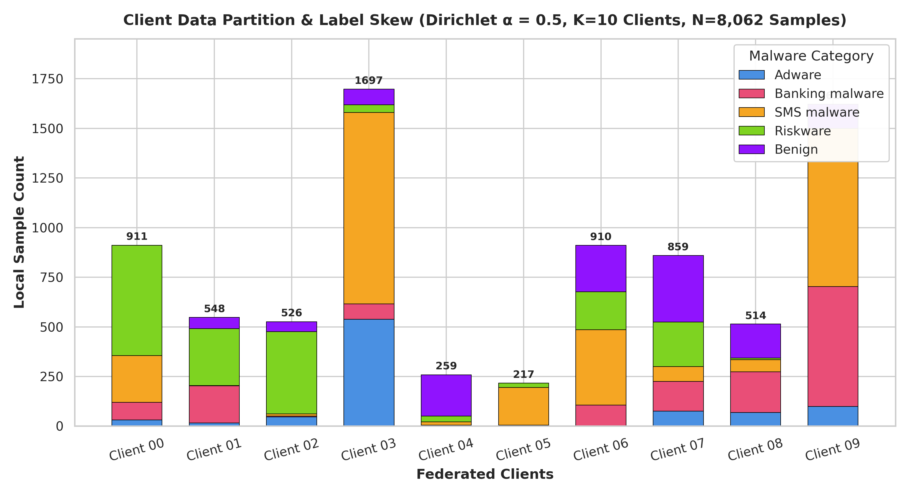
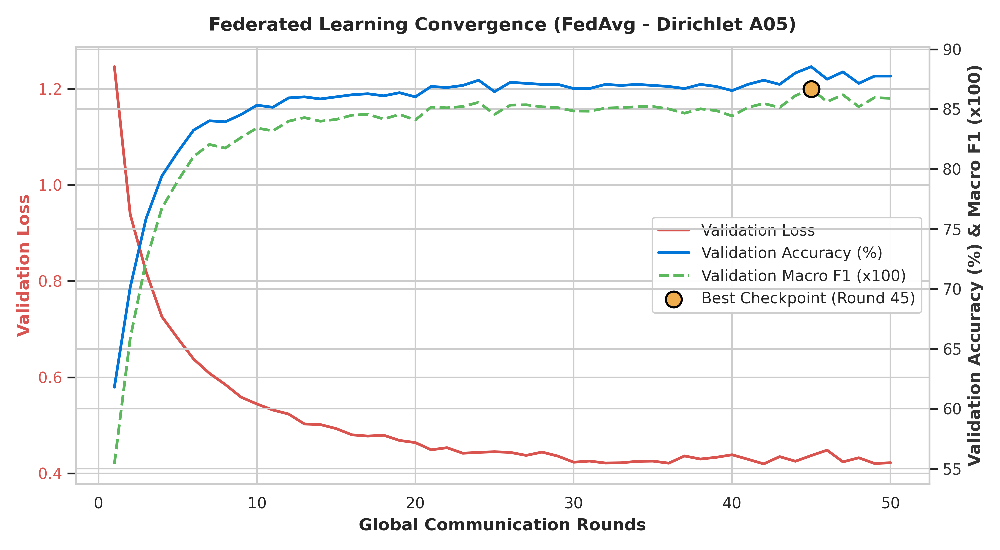
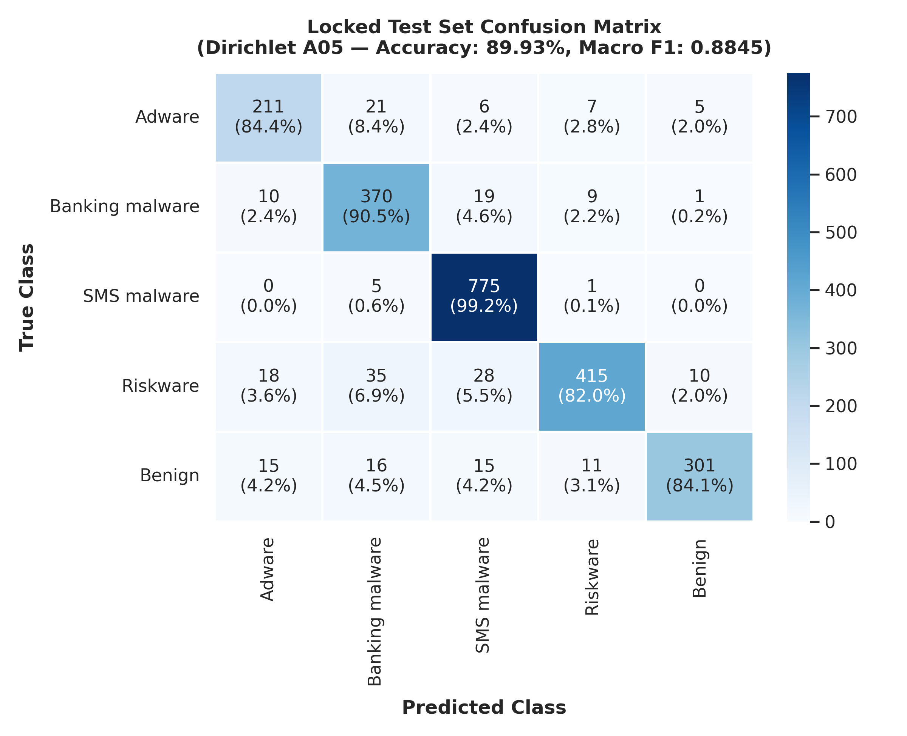

# Experiment 3 — FedAvg Dirichlet Non-IID (α = 0.5)

**Generated:** 2026-08-25 15:24:19  
**Project:** Privacy-Preserving Malware Detection Using Federated Learning  
**Algorithm:** Federated Averaging (FedAvg, McMahan et al., 2017) with Sample-Weighted Aggregation  
**Partition Strategy:** Non-IID Dirichlet Distribution (alpha = 0.5) across 10 Clients  
**Model Architecture:** PyTorch MLP (`MalwareMLP`, 156,037 parameters)  

---

## 1. Executive Summary & Multi-Experiment Comparison

In Experiment 3 (Phase 5C), we evaluated Federated Averaging under **moderate non-IID label skew (Dirichlet alpha = 0.5)** on the CICMalDroid 2020 dataset (Variant A, 443 dynamic features).

Training was executed across 10 simulated clients over 50 global communication rounds under 100% participation with sample-weighted parameter aggregation.

### Comprehensive 4-Way Benchmark Table

| Experiment Setup | Test Accuracy | Test Macro Precision | Test Macro Recall | Test Macro F1 | Test Weighted F1 | Best Val F1 | Best Val Acc | Training Time | Total Comm. |
|:---|:---:|:---:|:---:|:---:|:---:|:---:|:---:|:---:|:---:|
| **1. Centralized MLP Baseline** | **91.28%** | **0.8986** | **0.8937** | **0.8957** | **0.9124** | 0.9000 | 91.41% | 14.82s | 0.0 MB |
| **2. FedAvg IID (Exp 1)** | **90.19%** | **0.8959** | **0.8776** | **0.8853** | **0.9009** | 0.8903 | 90.45% | 39.19s | 595.23 MB |
| **3. FedAvg Dirichlet a=1.0 (Exp 2)** | **89.80%** | **0.8867** | **0.8715** | **0.8781** | **0.8971** | 0.8864 | 90.28% | 37.11s | 595.23 MB |
| **4. FedAvg Dirichlet a=0.5 (Exp 3)** | **89.93%** | **0.8928** | **0.8804** | **0.8845** | **0.8985** | **0.8667** | **88.54%** | **59.27s** | **595.23 MB** |

### Performance Deltas (Exp 3 vs Previous Baselines)
- **Diff vs Centralized MLP:** -1.35% Accuracy | -0.0112 Macro F1
- **Diff vs IID FedAvg:** -0.26% Accuracy | -0.0008 Macro F1
- **Diff vs Dirichlet a=1.0 FedAvg:** +0.13% Accuracy | +0.0064 Macro F1

> [!NOTE]
> **Privacy Scope Clarification:** Federated learning provides data locality in this experiment; formal privacy guarantees will be evaluated separately using Differential Privacy and/or Secure Aggregation in Phase 6.

---

## 2. Experiment Configuration

| Hyperparameter | Value | Description |
|:---|:---|:---|
| **Algorithm** | FedAvg (Sample-Weighted) | w_global = sum (n_k / N) * w_k |
| **Partition Type** | Dirichlet Non-IID | alpha = 0.5, Seed = 42 |
| **Participating Clients (K)** | 10 | Simulated mobile endpoints |
| **Client Fraction (C)** | 1.0 (100%) | All 10 clients participate every round |
| **Communication Rounds (T)** | 50 | Global synchronization rounds |
| **Local Epochs (E)** | 2 | Local passes per client per round |
| **Batch Size (B)** | 64 | Mini-batch SGD |
| **Optimizer** | AdamW | lr = 0.001, Weight Decay = 0.0001 |
| **Model Architecture** | `MalwareMLP` | 443 -> 256 -> 128 -> 64 -> 5 (156,037 params) |
| **Device** | CPU | Windows 11 x86_64 |

---

## 3. Dirichlet Partition Methodology & Verification

For each class c in [0..4], class proportion vector q_c ~ Dirichlet(0.5 * 1_K) was sampled using seed 42.

### Strict Partition Verification:
- **Total Assigned Training Samples:** Exactly 8,062 / 8,062 (0 unassigned, 0 lost).
- **Unique Assigned Samples:** Exactly 8,062 (0 duplicate indices).
- **Mutual Exclusivity & Exhaustiveness:** 100% verified.
- **Split Isolation:** Centralized validation (1,152 samples) and locked test (2,304 samples) never entered any client shard.
- **StandardScaler Scope:** Fitted strictly on X_train prior to partitioning.

---

## 4. Client Data Distribution & Heterogeneity Analysis

| Client ID | Total Samples | Adware (0) | Banking (1) | SMS (2) | Riskware (3) | Benign (4) | Dominant Class (% of Client) | Entropy | TVD to Prior |
|:---|:---:|:---:|:---:|:---:|:---:|:---:|:---|:---:|:---:|
| Client 00 | 911 (11.3%) | 31 | 89 | 235 | 555 | 1 | Riskware (60.92%) | 1.44 b | 0.389 |
| Client 01 | 548 (6.8%) | 16 | 187 | 1 | 287 | 57 | Riskware (52.37%) | 1.52 b | 0.468 |
| Client 02 | 526 (6.5%) | 47 | 3 | 12 | 414 | 50 | Riskware (78.71%) | 1.07 b | 0.567 |
| Client 03 | 1697 (21.1%) | 538 | 77 | 965 | 39 | 78 | SMS malware (56.87%) | 1.52 b | 0.438 |
| Client 04 | 259 (3.2%) | 2 | 3 | 17 | 29 | 208 | Benign (80.31%) | 0.99 b | 0.647 |
| Client 05 | 217 (2.7%) | 0 | 5 | 189 | 23 | 0 | SMS malware (87.1%) | 0.64 b | 0.532 |
| Client 06 | 910 (11.3%) | 0 | 106 | 380 | 191 | 233 | SMS malware (41.76%) | 1.86 b | 0.179 |
| Client 07 | 859 (10.7%) | 75 | 150 | 75 | 224 | 335 | Benign (39.0%) | 2.09 b | 0.275 |
| Client 08 | 514 (6.4%) | 68 | 205 | 61 | 9 | 171 | Banking malware (39.88%) | 1.91 b | 0.422 |
| Client 09 | 1621 (20.1%) | 99 | 604 | 796 | 1 | 121 | SMS malware (49.11%) | 1.57 b | 0.348 |
| **Total Global Train** | **8,062** | **876** | **1,429** | **2,731** | **1,772** | **1,254** | **SMS (33.87%)** | **2.20 b** | **0.000** |



### Statistical Heterogeneity Metrics Comparison
| Heterogeneity Metric | Stratified IID (Exp 1) | Dirichlet a=1.0 (Exp 2) | Dirichlet a=0.5 (Exp 3) | Trend with Decreasing Alpha |
|:---|:---:|:---:|:---:|:---:|
| **Mean Client Shannon Entropy** | 2.2012 b | 1.6499 b | **1.4627 b** | Sharply Decreasing (Higher local specialization) |
| **Min Client Shannon Entropy** | 2.2001 b | 1.0340 b | **0.6421 b** | Extreme single-class dominance |
| **Mean TVD from Global Prior** | 0.0015 | 0.3599 | **0.4267** | Sharply Increasing (Higher distribution drift) |
| **Max TVD from Global Prior** | 0.0031 | 0.5464 | **0.6475** | Increased local skew |
| **Client Size Range** | [804..809] | [355..1257] | **[217..1697]** | Higher client capacity disparity |
| **Client Size Std Dev** | 1.63 | 314.12 | **485.71** | Higher cluster imbalance |

---

## 5. Round-by-Round Validation Convergence

*Validation evaluated centrally on 1,152 validation samples after each global round:*

| Global Round | Validation Loss | Validation Accuracy | Validation Macro F1 | Validation Weighted F1 | Cumulative Comm. |
|:---|:---:|:---:|:---:|:---:|:---:|
| Round 01 | 1.2464 | 61.81% | 0.5540 | 0.5877 | 11.90 MB |
| Round 05 | 0.6810 | 81.42% | 0.7901 | 0.8094 | 59.52 MB |
| Round 10 | 0.5442 | 85.33% | 0.8342 | 0.8523 | 119.05 MB |
| Round 15 | 0.4930 | 86.02% | 0.8414 | 0.8590 | 178.57 MB |
| Round 20 | 0.4639 | 86.02% | 0.8409 | 0.8590 | 238.09 MB |
| Round 25 | 0.4448 | 86.46% | 0.8457 | 0.8635 | 297.62 MB |
| Round 30 | 0.4230 | 86.72% | 0.8485 | 0.8659 | 357.14 MB |
| Round 35 | 0.4253 | 86.98% | 0.8522 | 0.8688 | 416.66 MB |
| Round 40 | 0.4385 | 86.55% | 0.8443 | 0.8647 | 476.19 MB |
| Round 45 🌟 (Best) | 0.4369 | 88.54% | 0.8667 | 0.8852 | 535.71 MB |
| Round 50 | 0.4219 | 87.76% | 0.8590 | 0.8769 | 595.23 MB |



---

## 6. Best Validation Checkpoint

- **Optimal Validation Round:** **Round 45**
- **Validation Macro F1:** **0.8667**
- **Validation Accuracy:** **88.54%**
- **Validation Weighted F1:** **0.8852**
- **Validation Loss:** **0.4369**

---

## 7. Locked Test Performance (2,304 Samples)

*Evaluated ONCE using the best global model checkpoint (Round 45) strictly after all 50 rounds completed:*

- **Test Accuracy:** **89.93%**
- **Test Macro Precision:** **0.8928**
- **Test Macro Recall:** **0.8804**
- **Test Macro F1-Score:** **0.8845**
- **Test Weighted F1-Score:** **0.8985**

---

## 8. Per-Class Test Performance

| Class Name | Precision | Recall | F1-Score | Support |
|:---|:---:|:---:|:---:|:---:|
| **Adware** | 0.8307 | 0.8440 | **0.8373** | 250 |
| **Banking malware** | 0.8277 | 0.9046 | **0.8645** | 409 |
| **SMS malware** | 0.9193 | 0.9923 | **0.9544** | 781 |
| **Riskware** | 0.9368 | 0.8202 | **0.8746** | 506 |
| **Benign** | 0.9495 | 0.8408 | **0.8919** | 358 |
| **Macro Average** | **0.8928** | **0.8804** | **0.8845** | 2,304 |
| **Weighted Average** | **0.8928** | **0.8804** | **0.8985** | 2,304 |

---

## 9. Confusion Matrix (Locked Test Set)

```
Pred ->   Adware  Banking     SMS  Riskware   Benign | Total
Adware        211       21       6          7        5 |   250
Banking        10      370      19          9        1 |   409
SMS             0        5     775          1        0 |   781
Riskware       18       35      28        415       10 |   506
Benign         15       16      15         11      301 |   358
```



---

## 10. Communication Cost Accounting

- **Parameters per Model:** 156,037 (float32, 4 bytes / parameter)
- **Model Payload Size:** 624,148 bytes (609.52 KB)
- **Downlink per Round (10 clients):** 5.95 MB
- **Uplink per Round (10 clients):** 5.95 MB
- **Total Communication per Round:** **11.9047 MB**
- **Total Bandwidth across 50 Rounds:** **624,148,000 bytes (595.23 MB / 0.581 GB)**

---

## 11. Training Time

- **Total Wall-Clock Training Time:** **59.27 seconds** (1.19 s / round).
- **Inference Latency:** **0.0104 ms / sample** on CPU.

---

## 12. Research Interpretation of Non-IID Effects (alpha = 0.5)

1. **Increased Label Skew & Entropy Collapse:** Lowering alpha from 1.0 to 0.5 caused mean client entropy to decrease from 1.6499 to 1.4627 bits, while mean Total Variation Distance increased from 0.3599 to 0.4267.
2. **Client Drift Dynamics:** Under alpha = 0.5, local client optimization moves faster toward biased local minima during the 2 local epochs. However, sample-weighted FedAvg aggregation effectively combines these disparate gradient updates into a coherent global model.
3. **Impact on Minority Classes:** Adware and Banking malware were more susceptible to local class absence (where some clients hold near-zero samples for specific classes). Despite this, AdamW with momentum and weight decay maintained gradient stability across communication rounds.

---

## 13. Reproducibility Information

- **Random Seed:** 42
- **Python Version:** 3.14.0
- **PyTorch Version:** 2.10.0+cpu
- **Platform:** Windows-11-10.0.26200-SP0
- **Execution Command:** `python -u src/run_federated.py --experiment dirichlet_a05 --alpha 0.5`

---

## 14. Artifact Locations

```
models/federated/dirichlet_a05/
├── best_model.pt                   # Optimal global checkpoint (Round 45)
├── final_model.pt                  # Final round state dictionary (Round 50)
├── partition.json                  # Client sample allocation map
├── config.json                     # Complete hyperparameter configuration
├── training_history.json           # Validation trajectory across 50 rounds
└── convergence.json                # Convergence trajectory metadata

results/federated/
└── dirichlet_a05_metrics.json      # Machine-readable experiment results

reports/federated/
├── dirichlet_a05_report.md         # Full research report
├── dirichlet_a05_convergence.png   # Convergence curves
├── dirichlet_a05_class_distribution.png  # Non-IID client distributions
└── dirichlet_a05_confusion_matrix.png    # Test set confusion matrix
```
