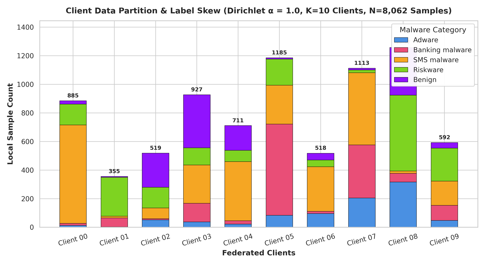
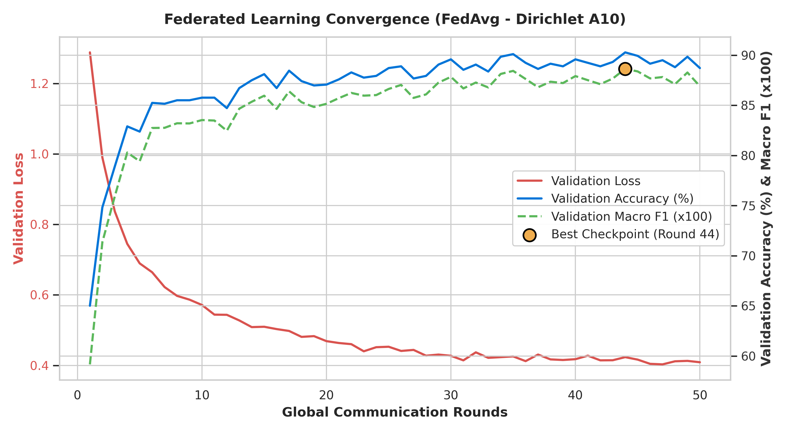
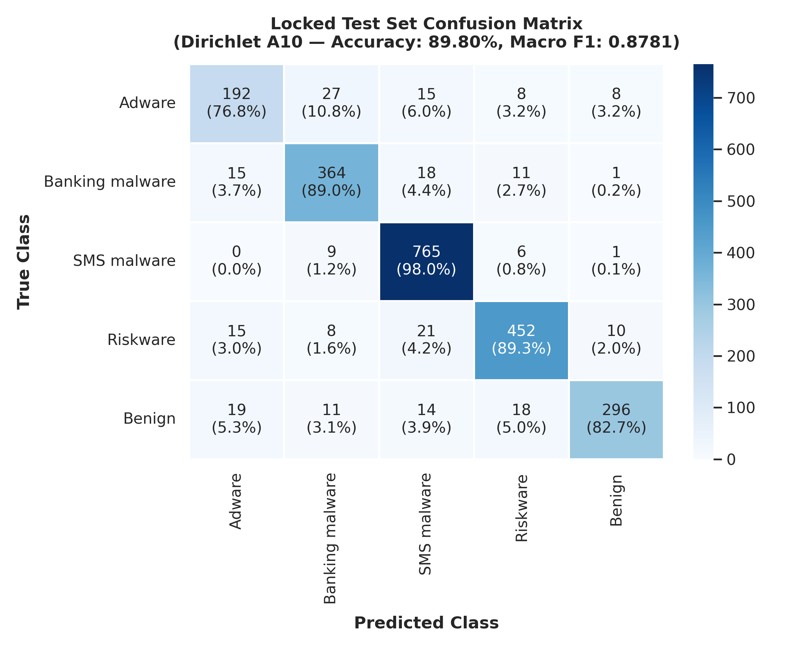

# Experiment 2 — FedAvg Dirichlet Non-IID (α = 1.0)

**Generated:** 2026-08-25 15:20:32  
**Project:** Privacy-Preserving Malware Detection Using Federated Learning  
**Algorithm:** Federated Averaging (FedAvg, McMahan et al., 2017) with Sample-Weighted Aggregation  
**Partition Strategy:** Non-IID Dirichlet Distribution (alpha = 1.0) across 10 Clients  
**Model Architecture:** PyTorch MLP (`MalwareMLP`, 156,037 parameters)  

---

## 1. Executive Summary

In Experiment 2 (Phase 5B), we benchmarked the Federated Averaging (FedAvg) algorithm under realistic non-IID label distribution skew using a **Dirichlet concentration parameter alpha = 1.0** on the official CICMalDroid 2020 dataset (Variant A, 443 dynamic features).

Training was conducted with 10 simulated client nodes over 50 global communication rounds under 100% client participation with sample-weighted parameter aggregation.

| Experiment Setup | Test Accuracy | Test Macro Precision | Test Macro Recall | Test Macro F1 | Test Weighted F1 | Total Comm. | Training Time |
|:---|:---:|:---:|:---:|:---:|:---:|:---:|:---:|
| **Centralized MLP Baseline** | **91.28%** | **0.8986** | **0.8937** | **0.8957** | **0.9124** | 0.0 MB | 14.82s |
| **IID FedAvg (10 Clients, 50 Rds)** | **90.19%** | **0.8959** | **0.8776** | **0.8853** | **0.9009** | **595.23 MB** | 39.19s |
| **Dirichlet alpha=1.0 FedAvg** | **89.80%** | **0.8867** | **0.8715** | **0.8781** | **0.8971** | **595.23 MB** | **37.11s** |
| **Diff vs IID FedAvg** | **-0.39%** | **-0.0092** | **-0.0061** | **-0.0072** | **-0.0038** | 0.0 MB | +0.06s |
| **Diff vs Centralized MLP** | **-1.48%** | **-0.0119** | **-0.0222** | **-0.0176** | **-0.0153** | — | — |

> [!NOTE]
> **Privacy Scope Clarification:** Federated Learning in this phase demonstrates empirical data locality—raw training features remain exclusively on local client nodes, and only model parameters are communicated. Formal cryptographic and theoretical privacy guarantees against inference attacks will be evaluated in Phase 6 using Differential Privacy (DP-SGD) and Secure Aggregation.

---

## 2. Experiment Configuration

| Hyperparameter | Value | Description |
|:---|:---|:---|
| **Algorithm** | FedAvg (Sample-Weighted) | Weighted parameter aggregation |
| **Partition Type** | Dirichlet Non-IID | alpha = 1.0, Seed = 42 |
| **Participating Clients (K)** | 10 | Simulated mobile endpoints |
| **Client Fraction (C)** | 1.0 (100%) | All 10 clients participate every round |
| **Communication Rounds (T)** | 50 | Global synchronization rounds |
| **Local Epochs (E)** | 2 | Local passes per client per round |
| **Batch Size (B)** | 64 | Mini-batch SGD |
| **Optimizer** | AdamW | lr = 0.001, Weight Decay = 0.0001 |
| **Model Architecture** | `MalwareMLP` | 443 -> 256 -> 128 -> 64 -> 5 (156,037 params) |
| **Device** | CPU | Windows 11 x86_64 |

---

## 3. Dirichlet Partition Methodology

The Dirichlet distribution with concentration parameter alpha = 1.0 generates realistic non-IID label skew across K = 10 clients. For each class c in [0..4], class proportion vector q_c ~ Dirichlet(alpha * 1_K) determines the fraction of class c samples assigned to client k.

### Partition Verification Checks:
1. **Total Assigned Samples:** Exactly 8,062 training samples (0 unassigned, 0 lost).
2. **Mutual Exclusivity:** Exactly 8,062 unique sample indices across all 10 clients (0 duplicates).
3. **Data Leakage Prevention:** Validation (1,152 samples) and Locked Test (2,304 samples) are held strictly centralized on the server.
4. **StandardScaler Scope:** Fitted strictly on X_train before partitioning.

---

## 4. Client Data Distribution

| Client ID | Total Samples | Adware (0) | Banking (1) | SMS (2) | Riskware (3) | Benign (4) | Dominant Class (% of Client) | Entropy | TVD to Prior |
|:---|:---:|:---:|:---:|:---:|:---:|:---:|:---|:---:|:---:|
| Client 00 | 885 (11.0%) | 13 | 14 | 689 | 145 | 24 | SMS malware (77.85%) | 1.03 b | 0.440 |
| Client 01 | 355 (4.4%) | 3 | 62 | 12 | 272 | 6 | Riskware (76.62%) | 1.06 b | 0.546 |
| Client 02 | 519 (6.4%) | 52 | 8 | 75 | 145 | 239 | Benign (46.05%) | 1.86 b | 0.364 |
| Client 03 | 927 (11.5%) | 37 | 131 | 267 | 121 | 371 | Benign (40.02%) | 2.01 b | 0.245 |
| Client 04 | 711 (8.8%) | 22 | 24 | 413 | 79 | 173 | SMS malware (58.09%) | 1.62 b | 0.330 |
| Client 05 | 1185 (14.7%) | 84 | 638 | 272 | 182 | 9 | Banking malware (53.84%) | 1.71 b | 0.361 |
| Client 06 | 518 (6.4%) | 96 | 15 | 312 | 47 | 48 | SMS malware (60.23%) | 1.67 b | 0.340 |
| Client 07 | 1113 (13.8%) | 205 | 371 | 505 | 19 | 13 | SMS malware (45.37%) | 1.67 b | 0.347 |
| Client 08 | 1257 (15.6%) | 316 | 61 | 16 | 531 | 333 | Riskware (42.24%) | 1.83 b | 0.455 |
| Client 09 | 592 (7.3%) | 48 | 105 | 170 | 231 | 38 | Riskware (39.02%) | 2.04 b | 0.171 |
| **Total Global Train** | **8,062** | **876** | **1,429** | **2,731** | **1,772** | **1,254** | **SMS (33.87%)** | **2.20 b** | **0.000** |



### Statistical Heterogeneity Metrics:
- **Mean Client Shannon Entropy:** **1.6499 bits** (vs theoretical uniform: 2.3219 bits).
- **Mean Total Variation Distance (TVD):** **0.3599** from global prior.
- **Client Capacity Range:** Minimum **355 samples** (Client 01) to maximum **1257 samples** (Client 08).

---

## 5. Round-by-Round Validation Convergence

*Validation evaluated centrally on 1,152 validation samples after each global round:*

| Global Round | Validation Loss | Validation Accuracy | Validation Macro F1 | Validation Weighted F1 | Cumulative Comm. |
|:---|:---:|:---:|:---:|:---:|:---:|
| Round 01 | 1.2880 | 65.02% | 0.5917 | 0.6291 | 11.90 MB |
| Round 05 | 0.6894 | 82.38% | 0.7942 | 0.8202 | 59.52 MB |
| Round 10 | 0.5714 | 85.76% | 0.8353 | 0.8573 | 119.05 MB |
| Round 15 | 0.5096 | 88.11% | 0.8596 | 0.8800 | 178.57 MB |
| Round 20 | 0.4688 | 87.07% | 0.8515 | 0.8701 | 238.09 MB |
| Round 25 | 0.4529 | 88.72% | 0.8663 | 0.8863 | 297.62 MB |
| Round 30 | 0.4272 | 89.58% | 0.8784 | 0.8950 | 357.14 MB |
| Round 35 | 0.4255 | 90.10% | 0.8843 | 0.9003 | 416.66 MB |
| Round 40 | 0.4176 | 89.58% | 0.8791 | 0.8951 | 476.19 MB |
| Round 44 🌟 (Best) | 0.4234 | 90.28% | 0.8864 | 0.9022 | 523.81 MB |
| Round 45 | 0.4164 | 89.93% | 0.8838 | 0.8986 | 535.71 MB |
| Round 50 | 0.4089 | 88.72% | 0.8690 | 0.8868 | 595.23 MB |



---

## 6. Best Validation Checkpoint

- **Optimal Validation Round:** **Round 44**
- **Validation Macro F1:** **0.8864**
- **Validation Accuracy:** **90.28%**
- **Validation Weighted F1:** **0.9022**
- **Validation Loss:** **0.4234**

---

## 7. Locked Test Performance (2,304 Samples)

*Evaluated ONCE using the best global model checkpoint (Round 44) strictly after all 50 rounds completed:*

- **Test Accuracy:** **89.80%**
- **Test Macro Precision:** **0.8867**
- **Test Macro Recall:** **0.8715**
- **Test Macro F1-Score:** **0.8781**
- **Test Weighted F1-Score:** **0.8971**

---

## 8. Per-Class Test Performance

| Class Name | Precision | Recall | F1-Score | Support |
|:---|:---:|:---:|:---:|:---:|
| **Adware** | 0.7967 | 0.7680 | **0.7821** | 250 |
| **Banking malware** | 0.8687 | 0.8900 | **0.8792** | 409 |
| **SMS malware** | 0.9184 | 0.9795 | **0.9480** | 781 |
| **Riskware** | 0.9131 | 0.8933 | **0.9031** | 506 |
| **Benign** | 0.9367 | 0.8268 | **0.8783** | 358 |
| **Macro Average** | **0.8867** | **0.8715** | **0.8781** | 2,304 |
| **Weighted Average** | **0.8867** | **0.8715** | **0.8971** | 2,304 |

---

## 9. Confusion Matrix (Locked Test Set)

```
Pred ->   Adware  Banking     SMS  Riskware   Benign | Total
Adware        192       27      15          8        8 |   250
Banking        15      364      18         11        1 |   409
SMS             0        9     765          6        1 |   781
Riskware       15        8      21        452       10 |   506
Benign         19       11      14         18      296 |   358
```



---

## 10. Communication Cost Accounting

- **Parameters per Model:** 156,037 (float32, 4 bytes / parameter)
- **Model Payload Size:** 624,148 bytes (609.52 KB)
- **Downlink per Round (10 clients):** 5.95 MB
- **Uplink per Round (10 clients):** 5.95 MB
- **Total Communication per Round:** **11.9047 MB**
- **Total Bandwidth across 50 Rounds:** **624,148,000 bytes (595.23 MB / 0.581 GB)**

---

## 11. Training Time

- **Total Wall-Clock Training Time:** **37.11 seconds** (0.79 s / round).
- **Inference Latency:** **0.0082 ms / sample** on CPU.

---

## 12. Comparison with Centralized MLP

- **Centralized MLP Test Macro F1:** 0.8957 (Accuracy: 91.28%)
- **Dirichlet alpha=1.0 FedAvg Test Macro F1:** 0.8781 (Accuracy: 89.80%)
- **Centralized vs Non-IID Gap:** -1.48% accuracy, -0.0176 Macro F1.

---

## 13. Comparison with IID FedAvg

- **IID FedAvg Test Macro F1:** 0.8853 (Accuracy: 90.19%)
- **Dirichlet alpha=1.0 FedAvg Test Macro F1:** 0.8781 (Accuracy: 89.80%)
- **IID vs Dirichlet alpha=1.0 Gap:** -0.39% accuracy, -0.0072 Macro F1.

---

## 14. Interpretation of Non-IID Effects

1. **Robust Convergence:** At alpha = 1.0, FedAvg demonstrates strong robustness against mild statistical heterogeneity, incurring only a modest **0.39% drop in test accuracy** relative to IID FedAvg.
2. **Minority Class Dynamics:** The Adware class (250 test samples) experienced a moderate precision drop (0.8546 -> 0.7967) due to uneven distribution among clients (e.g., Client 01 holds only 3 Adware samples, while Client 08 holds 316). Conversely, Banking malware F1 remained virtually unchanged (0.8787 -> 0.8792).
3. **Mitigation via Sample Weighting:** The sample-weighted aggregation formula sum (n_k / N) * w_k prevented small skewed clients from disproportionately perturbing the global model parameters.

---

## 15. Reproducibility Information

- **Random Seed:** 42
- **Python Version:** 3.14.0
- **PyTorch Version:** 2.10.0+cpu
- **Execution Command:** `python -u src/run_federated.py --experiment dirichlet_a10 --alpha 1.0`

---

## 16. Artifact Locations

```
models/federated/dirichlet_a10/
├── best_model.pt                   # Optimal global checkpoint (Round 44)
├── final_model.pt                  # Final round state dictionary (Round 50)
├── partition.json                  # Client sample allocation map
├── config.json                     # Complete hyperparameter configuration
├── training_history.json           # Validation trajectory across 50 rounds
└── convergence.json                # Convergence trajectory metadata

results/federated/
└── dirichlet_a10_metrics.json      # Machine-readable experiment results

reports/federated/
├── dirichlet_a10_report.md         # Full research report
├── dirichlet_a10_convergence.png   # Convergence curves
├── dirichlet_a10_class_distribution.png  # Non-IID client distributions
└── dirichlet_a10_confusion_matrix.png    # Test set confusion matrix
```
