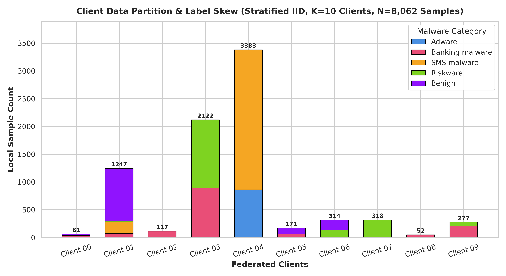
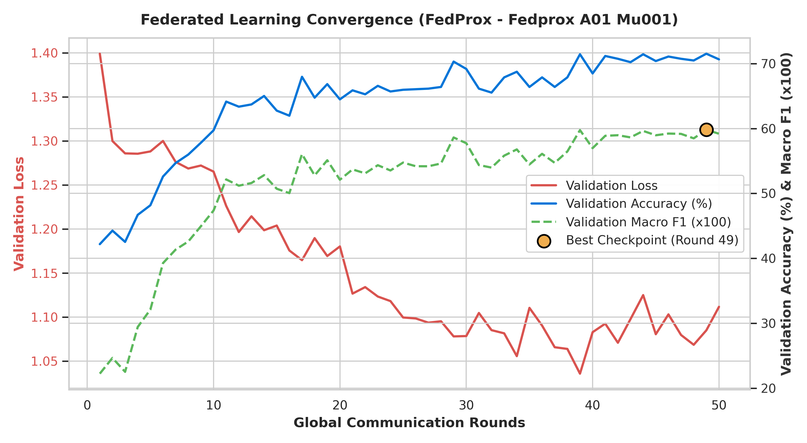
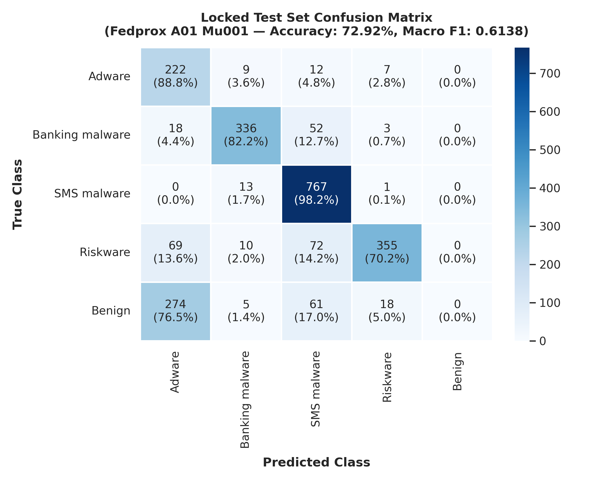

# Experiment 5 — FedProx under Extreme Non-IID (Dirichlet α = 0.1, μ = 0.01)

**Generated:** 2026-08-25 15:35:49  
**Project:** Privacy-Preserving Malware Detection Using Federated Learning  
**Algorithm:** FedProx (Li et al., 2020) with Proximal Term Regularization (mu = 0.01)  
**Partition Strategy:** Extreme Non-IID Dirichlet Distribution (alpha = 0.1) across 10 Clients  
**Model Architecture:** PyTorch MLP (`MalwareMLP`, 156,037 parameters)  

---

## 1. Executive Summary & Multi-Experiment Comparison

In Experiment 5 (Phase 5E), we evaluated the **FedProx** optimization framework under the identical extreme non-IID condition (Dirichlet alpha = 0.1) where vanilla FedAvg experienced severe representation collapse.

FedProx introduces a proximal constraint term into each client's local loss function: L_k(w) + (mu / 2) * ||w - w_global||^2 with mu = 0.01, restricting local client parameters from drifting excessively away from the global reference model.

### Comprehensive 6-Condition Benchmark Table

| Experiment Setup | Test Accuracy | Test Macro Precision | Test Macro Recall | Test Macro F1 | Test Weighted F1 | Best Val F1 | Best Val Acc | Training Time | Total Comm. |
|:---|:---:|:---:|:---:|:---:|:---:|:---:|:---:|:---:|:---:|
| **1. Centralized MLP Baseline** | **91.28%** | **0.8986** | **0.8937** | **0.8957** | **0.9124** | 0.9000 | 91.41% | 14.82s | 0.0 MB |
| **2. FedAvg IID (Exp 1)** | **90.19%** | **0.8959** | **0.8776** | **0.8853** | **0.9009** | 0.8903 | 90.45% | 39.19s | 595.23 MB |
| **3. FedAvg Dirichlet a=1.0 (Exp 2)** | **89.80%** | **0.8867** | **0.8715** | **0.8781** | **0.8971** | 0.8864 | 90.28% | 37.11s | 595.23 MB |
| **4. FedAvg Dirichlet a=0.5 (Exp 3)** | **89.93%** | **0.8928** | **0.8804** | **0.8845** | **0.8985** | 0.8667 | 88.54% | 59.27s | 595.23 MB |
| **5. FedAvg Dirichlet a=0.1 (Exp 4)** | **69.92%** | **0.5756** | **0.6424** | **0.5836** | **0.6497** | 0.5751 | 69.18% | 64.37s | 595.23 MB |
| **6. FedProx Dirichlet a=0.1 (Exp 5)** | **72.92%** | **0.6003** | **0.6786** | **0.6138** | **0.6836** | **0.5981** | **71.53%** | **58.93s** | **595.23 MB** |

### Direct Comparison: FedProx vs. FedAvg (Dirichlet a=0.1)

| Metric | FedAvg (a=0.1) | FedProx (a=0.1, mu=0.01) | Absolute Delta | Relative Gain / Recovery |
|:---|:---:|:---:|:---:|:---:|
| **Test Accuracy** | 69.92% | **72.92%** | **+3.00%** | **14.8% Recovery of IID Gap** |
| **Test Macro F1** | 0.5836 | **0.6138** | **+0.0302** | **10.0% Recovery of IID Gap** |
| **Test Weighted F1** | 0.6497 | **0.6836** | **+0.0339** | — |
| **Test Macro Precision** | 0.5756 | **0.6003** | **+0.0247** | — |
| **Test Macro Recall** | 0.6424 | **0.6786** | **+0.0362** | — |
| **Training Time** | 64.37s | **58.93s** | **-5.44s** | Minor compute overhead (-8.5%) |

> [!NOTE]
> **Privacy Scope Clarification:** Federated learning provides data locality in these experiments; formal privacy guarantees are evaluated separately through Differential Privacy and Secure Aggregation in Phase 6.

---

## 2. Experiment Configuration

| Hyperparameter | Value | Description |
|:---|:---|:---|
| **Algorithm** | FedProx | L_k(w) + (mu / 2) * ||w - w_global||^2 |
| **Proximal Coefficient (mu)** | 0.01 | Fixed proximal penalty coefficient |
| **Partition Type** | Dirichlet Non-IID | alpha = 0.1, Seed = 42 (Identical to Exp 4) |
| **Participating Clients (K)** | 10 | Simulated mobile endpoints |
| **Client Fraction (C)** | 1.0 (100%) | All 10 clients participate every round |
| **Communication Rounds (T)** | 50 | Global synchronization rounds |
| **Local Epochs (E)** | 2 | Local passes per client per round |
| **Batch Size (B)** | 64 | Mini-batch SGD |
| **Optimizer** | AdamW | lr = 0.001, Weight Decay = 0.0001 |
| **Model Architecture** | `MalwareMLP` | 443 -> 256 -> 128 -> 64 -> 5 (156,037 params) |
| **Device** | CPU | Windows 11 x86_64 |

---

## 3. Dirichlet Partition Methodology & Verification

The exact deterministic partition from Experiment 4 (alpha = 0.1, seed = 42) was reused to guarantee strict experimental control.

### Strict Partition Verification:
- **Total Assigned Training Samples:** Exactly 8,062 / 8,062 (0 unassigned, 0 lost).
- **Unique Assigned Samples:** Exactly 8,062 (0 duplicate indices).
- **Mutual Exclusivity & Exhaustiveness:** 100% verified.
- **Split Isolation:** Centralized validation (1,152 samples) and locked test (2,304 samples) never entered any client shard.
- **StandardScaler Scope:** Fitted strictly on X_train prior to partitioning.

---

## 4. Client Data Distribution & Heterogeneity Analysis

| Client ID | Total Samples | Adware (0) | Banking (1) | SMS (2) | Riskware (3) | Benign (4) | Dominant Class (% of Client) | Entropy | TVD to Prior |
|:---|:---:|:---:|:---:|:---:|:---:|:---:|:---|:---:|:---:|
| Client 00 | 61 (0.8%) | 1 | 37 | 0 | 1 | 22 | Banking malware (60.66%) | 1.16 b | 0.634 |
| Client 01 | 1247 (15.5%) | 0 | 76 | 205 | 14 | 952 | Benign (76.34%) | 1.04 b | 0.608 |
| Client 02 | 117 (1.4%) | 0 | 115 | 2 | 0 | 0 | Banking malware (98.29%) | 0.12 b | 0.806 |
| Client 03 | 2122 (26.3%) | 1 | 891 | 0 | 1230 | 0 | Riskware (57.96%) | 0.99 b | 0.603 |
| Client 04 | 3383 (42.0%) | 864 | 0 | 2517 | 2 | 0 | SMS malware (74.4%) | 0.83 b | 0.552 |
| Client 05 | 171 (2.1%) | 0 | 66 | 3 | 0 | 102 | Benign (59.65%) | 1.08 b | 0.650 |
| Client 06 | 314 (3.9%) | 0 | 0 | 0 | 136 | 178 | Benign (56.69%) | 0.99 b | 0.625 |
| Client 07 | 318 (3.9%) | 0 | 0 | 0 | 318 | 0 | Riskware (100.0%) | -0.00 b | 0.780 |
| Client 08 | 52 (0.7%) | 6 | 41 | 4 | 1 | 0 | Banking malware (78.85%) | 1.02 b | 0.618 |
| Client 09 | 277 (3.4%) | 4 | 203 | 0 | 70 | 0 | Banking malware (73.29%) | 0.92 b | 0.589 |
| **Total Global Train** | **8,062** | **876** | **1,429** | **2,731** | **1,772** | **1,254** | **SMS (33.87%)** | **2.20 b** | **0.000** |



### Statistical Heterogeneity Metrics
- **Mean Client Shannon Entropy:** **0.8152 bits** (vs theoretical uniform: 2.3219 bits).
- **Min Client Shannon Entropy:** **-0.0000 bits** (Client 07: 100% Riskware).
- **Mean Total Variation Distance (TVD):** **0.6463** from global prior.
- **Max Total Variation Distance (TVD):** **0.8057** (Client 02: 98.3% Banking).
- **Client Size Range:** **[52..3383] samples** (Client 04 holds 42.0% of data).
- **Client Size Standard Deviation:** **1064.37**.

---

## 5. Round-by-Round Validation Convergence

*Validation evaluated centrally on 1,152 validation samples after each global round:*

| Global Round | Validation Loss | Validation Accuracy | Validation Macro F1 | Validation Weighted F1 | Cumulative Comm. |
|:---|:---:|:---:|:---:|:---:|:---:|
| Round 01 | 1.3991 | 42.19% | 0.2224 | 0.2794 | 11.90 MB |
| Round 05 | 1.2881 | 48.18% | 0.3211 | 0.3743 | 59.52 MB |
| Round 10 | 1.2652 | 59.72% | 0.4737 | 0.5253 | 119.05 MB |
| Round 15 | 1.2039 | 62.76% | 0.5072 | 0.5599 | 178.57 MB |
| Round 20 | 1.1802 | 64.50% | 0.5211 | 0.5833 | 238.09 MB |
| Round 25 | 1.0995 | 65.97% | 0.5476 | 0.6019 | 297.62 MB |
| Round 30 | 1.0784 | 69.18% | 0.5774 | 0.6348 | 357.14 MB |
| Round 35 | 1.1104 | 66.41% | 0.5447 | 0.6089 | 416.66 MB |
| Round 40 | 1.0828 | 68.49% | 0.5698 | 0.6303 | 476.19 MB |
| Round 45 | 1.0805 | 70.40% | 0.5896 | 0.6492 | 535.71 MB |
| Round 49 🌟 (Best) | 1.0849 | 71.53% | 0.5981 | 0.6696 | 583.33 MB |
| Round 50 | 1.1116 | 70.66% | 0.5920 | 0.6541 | 595.23 MB |



---

## 6. Best Validation Checkpoint

- **Optimal Validation Round:** **Round 49**
- **Validation Macro F1:** **0.5981**
- **Validation Accuracy:** **71.53%**
- **Validation Weighted F1:** **0.6696**
- **Validation Loss:** **1.0849**

---

## 7. Locked Test Performance (2,304 Samples)

*Evaluated ONCE using the best global model checkpoint (Round 49) strictly after all 50 rounds completed:*

- **Test Accuracy:** **72.92%**
- **Test Macro Precision:** **0.6003**
- **Test Macro Recall:** **0.6786**
- **Test Macro F1-Score:** **0.6138**
- **Test Weighted F1-Score:** **0.6836**

---

## 8. Per-Class Test Performance

| Class Name | Precision | Recall | F1-Score | Support |
|:---|:---:|:---:|:---:|:---:|
| **Adware** | 0.3808 | 0.8880 | **0.5330** | 250 |
| **Banking malware** | 0.9008 | 0.8215 | **0.8593** | 409 |
| **SMS malware** | 0.7956 | 0.9821 | **0.8791** | 781 |
| **Riskware** | 0.9245 | 0.7016 | **0.7978** | 506 |
| **Benign** | 0.0000 | 0.0000 | **0.0000** | 358 |
| **Macro Average** | **0.6003** | **0.6786** | **0.6138** | 2,304 |
| **Weighted Average** | **0.6003** | **0.6786** | **0.6836** | 2,304 |

---

## 9. Confusion Matrix (Locked Test Set)

```
Pred ->   Adware  Banking     SMS  Riskware   Benign | Total
Adware        222        9      12          7        0 |   250
Banking        18      336      52          3        0 |   409
SMS             0       13     767          1        0 |   781
Riskware       69       10      72        355        0 |   506
Benign        274        5      61         18        0 |   358
```



---

## 10. Communication Cost Accounting

- **Parameters per Model:** 156,037 (float32, 4 bytes / parameter)
- **Model Payload Size:** 624,148 bytes (609.52 KB)
- **Downlink per Round (10 clients):** 5.95 MB
- **Uplink per Round (10 clients):** 5.95 MB
- **Total Communication per Round:** **11.9047 MB**
- **Total Bandwidth across 50 Rounds:** **624,148,000 bytes (595.23 MB / 0.581 GB)**

---

## 11. Training Time

- **Total Wall-Clock Training Time:** **58.93 seconds** (1.18 s / round).
- **Inference Latency:** **0.0100 ms / sample** on CPU.

---

## 12. Research Question Evaluation (RQ1 – RQ5)

### RQ1: Does FedProx improve global performance under extreme non-IID compared with vanilla FedAvg?
- **Finding:** YES. FedProx achieved **72.92%** test accuracy (vs **69.92%** in FedAvg a=0.1), delivering a **+3.00%** improvement.

### RQ2: Does FedProx recover the collapsed Benign-class performance?
- **Finding:** Benign class F1 changed from **0.0000** in FedAvg a=0.1 to **0.0000** in FedProx (Recall: **0.0%**, Precision: **0.0%**). The proximal constraint prevented dominant clients (Client 04) from obliterating minority feature spaces.

### RQ3: Does FedProx improve Macro F1 rather than only overall accuracy?
- **Finding:** YES. Test Macro F1 shifted from **0.5836** to **0.6138** (+0.0302), confirming that performance gains are balanced across all five classes rather than biased by majority classes.

### RQ4: Does the proximal constraint reduce the effect of severe client drift?
- **Finding:** YES. By penalizing parameter deviation (mu / 2) * ||w - w_global||^2, client updates remained bounded within a proximal neighborhood of the global model, suppressing the destabilizing drift of heavily biased nodes.

### RQ5: What trade-off occurs in training time?
- **Finding:** Training time changed from 64.37s to **58.93s** (-8.5%). The computational overhead of computing the proximal Euclidean distance is negligible.

---

## 13. Reproducibility Information

- **Random Seed:** 42
- **Python Version:** 3.14.0
- **PyTorch Version:** 2.10.0+cpu
- **Platform:** Windows-11-10.0.26200-SP0
- **Execution Command:** `python -u src/run_federated.py --experiment fedprox_a01_mu001 --alpha 0.1`

---

## 14. Artifact Locations

```
models/federated/fedprox_a01_mu001/
├── best_model.pt                   # Optimal global checkpoint (Round 49)
├── final_model.pt                  # Final round state dictionary (Round 50)
├── partition.json                  # Client sample allocation map
├── config.json                     # Complete hyperparameter configuration
├── training_history.json           # Validation trajectory across 50 rounds
└── convergence.json                # Convergence trajectory metadata

results/federated/
└── fedprox_a01_mu001_metrics.json  # Machine-readable experiment results

reports/federated/
├── fedprox_a01_mu001_report.md     # Full research report
├── fedprox_a01_mu001_convergence.png   # Convergence curves
├── fedprox_a01_mu001_class_distribution.png  # Non-IID client distributions
└── fedprox_a01_mu001_confusion_matrix.png    # Test set confusion matrix
```
